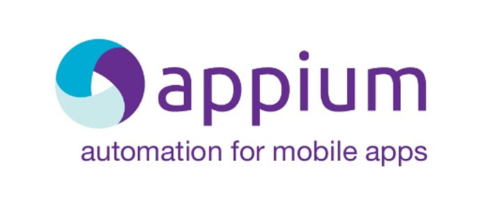

<!-- PROJECT SHIELDS -->

        
         
    
       
  
    

<!-- PROJECT LOGO -->

    
   

     
    <a href="#about-the-project"><strong>Read Instructions »</strong></a>
     
       
    <a href="https://github.com/mahmoudazaid/Appium.Test/wiki">Read the Wiki</a>
    .
    <a href="https://github.com/mahmoudazaid/Appium.Test/issues">Report Bug</a>
    ·
    <a href="https://github.com/mahmoudazaid/Appium.Test/issues">Request Feature</a>
  

# Appium.Test

<!-- TABLE OF CONTENTS -->
## Table of Contents

* [About the Project](#about-the-project)
  * [Built With](#built-with)
* [Getting Started](#getting-started)
  * [Prerequisites](#prerequisites)
  * [Installation](#installation)
* [Usage](#usage)
* [Contributing](#contributing)
* [Contact](#contact)

<!-- CONTRIBUTING -->
## Contributing

Contributions are what make the open source community such an amazing place to be learn, inspire, and create. Any contributions you make are **greatly appreciated**.

1. Fork the Project
2. Create your Feature Branch (`git checkout -b AmazingFeature`)
3. Commit your Changes (`git commit -m 'Add some AmazingFeature'`)
4. Push to the Branch (`git push origin AmazingFeature`)
5. Open a Pull Request

<!-- CONTACT -->
## Contact

Mahmoud A. Zaid - [Linkedin](https://www.linkedin.com/in/mahmoudazaid/)

Project Link: [RestSharp.Demo](https://github.com/mahmoudazaid/Appium.Test)

